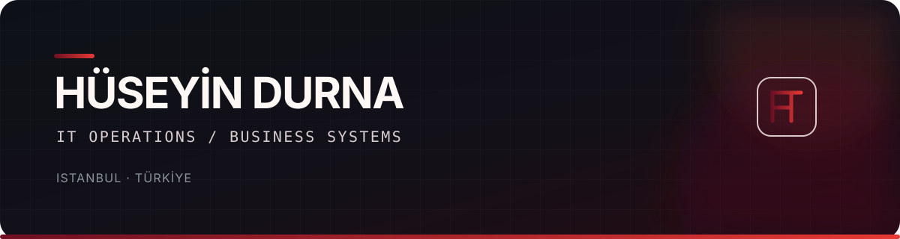

  

  I manage <a href="https://github.com/akel-melamin">@akel-melamin</a>'s IT infrastructure and build practical systems that make everyday work simpler.

## What I do

- Manage servers, networks, backups, access control and remote connectivity.
- Handle workplace technology end to end — from selecting and installing hardware to keeping it running.
- Support users and solve day-to-day technical problems across the company.
- Design and build internal business systems around real operational needs.

> I like systems that remove friction, work reliably and make daily operations simpler.

## Selected work

<table>
<tr>
<td width="50%" valign="top">

### [Lumen](https://github.com/husodrn46/Lumen)

A modern, mobile-friendly sales and inventory interface for businesses running LOGO Tiger ERP. Built on Microsoft SQL Server and used in production at AKEL Melamin.

`PHP` · `SQL Server` · `LOGO Tiger` · `PWA`

[View project →](https://github.com/husodrn46/Lumen)

</td>
<td width="50%" valign="top">

### [Ollama CLI](https://github.com/husodrn46/ollama-cli)

A feature-rich terminal interface for working with local Ollama models, including model management, vision support, sessions, benchmarks and exports.

`Python` · `Ollama` · `Rich` · `prompt_toolkit`

[View project →](https://github.com/husodrn46/ollama-cli)

</td>
</tr>
</table>

## Tools & technologies

  
  
  
  
  
  
  

## Current focus

Building and improving **Lumen**, while continuing to make AKEL's internal systems more reliable, accessible and useful.
