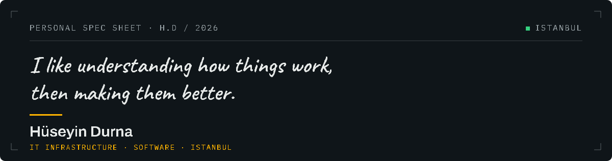

<picture>
  <source media="(prefers-color-scheme: dark)" srcset="assets/header-live.svg">
  <source media="(prefers-color-scheme: light)" srcset="assets/header-sheet.svg">
  
</picture>

I look after the servers, networks, backups and user support at [AKEL Melamin](https://akelmelamin.com) in Istanbul. When something stops, I'm the one they call — and alongside that I build the internal systems that make the work easier. Software, hardware and everyday work meet somewhere, and that is the part I find interesting.

**[husodrn46.com](https://husodrn46.com)** · [huseyindurna5@gmail.com](mailto:huseyindurna5@gmail.com)

## Now

| | |
|---|---|
|  **Running** | Keeping day-to-day systems up at AKEL |
|  **Building** | Lumen, around real sales and inventory needs |
|  **Testing** | Hardware, automation and whatever I'm curious about |

## Things I've made

| Status | Work | What it is |
|---|---|---|
|  Building | **[Lumen](https://github.com/husodrn46/Lumen)** | Getting at LOGO Tiger's data from a phone was painful, so I wrote an open-source interface that makes sales and inventory usable on mobile. `PHP` `PWA` `ERP` |
|  Running | **[AKEL Melamin](https://akelmelamin.com)** | Day-to-day operation of the IT infrastructure, and the internal systems built around it. `2022 — now` |
|  Running | **Nexus** | My own git server, file cloud, ad filter and monitoring board, all on a Raspberry Pi 5. I chose to build it rather than rent it, which means fixing it is on me too. `Pi 5` `Debian` `Docker` |
|  Building | **Command Center** | It started because I was tired of checking five tabs every morning. A data layer on Nexus, a macOS menu bar app on the same feed; a physical screen and a 3D-printed case come next. `Node.js` `Pi 5` `macOS` |
|  Experience | **42 Istanbul piscine** | Four weeks of C, algorithms, peer learning with no instructors, and a project to hand in every day. |

## What I work with

| | |
|---|---|
| **Servers** | Windows Server · Debian / Ubuntu |
| **Hardware** | Raspberry Pi 5 · NAS · Workstations |
| **Services** | Docker · Gitea · Nextcloud · Pi-hole · Uptime Kuma |
| **Access** | Tailscale · Cloudflare Tunnel |
| **Backup** | Windows Server Backup · NAS |
| **Code** | PHP · Python · SQL · Node.js |
| **Method** | Building with AI agents |

---

The header is the same sheet as <a href="https://husodrn46.com">husodrn46.com</a> — the live face in dark mode, the printed one in light.
