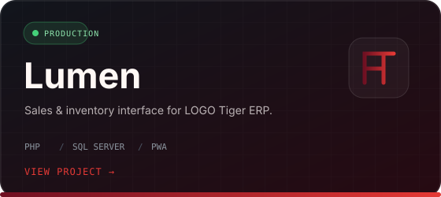
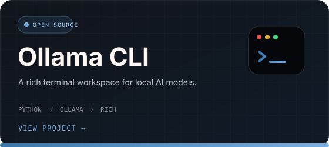

  

<h3 align="center">I keep systems running — and build better ones when existing tools slow people down.</h3>

  Managing <a href="https://github.com/akel-melamin">@akel-melamin</a>'s IT infrastructure and turning real operational needs into practical business systems.

  
  
  

 

## Operating at the intersection of infrastructure and software

<table>
<tr>
<td width="25%" valign="top">

**01 / INFRASTRUCTURE**

Servers, backups, access control and remote connectivity.

</td>
<td width="25%" valign="top">

**02 / NETWORKS**

Workplace networking, hardware selection and on-site installation.

</td>
<td width="25%" valign="top">

**03 / SUPPORT**

Technical problem-solving for users across the company.

</td>
<td width="25%" valign="top">

**04 / SYSTEMS**

Internal tools designed around real business workflows.

</td>
</tr>
</table>

 

## Selected systems

<table>
<tr>
<td width="50%" valign="top">

</td>
<td width="50%" valign="top">

</td>
</tr>
</table>

 

## Tools I work with

  
  
  
  
  
  

 

## Current signal

  

  Currently improving <strong>Lumen</strong> and making AKEL's internal systems more reliable, accessible and useful.

